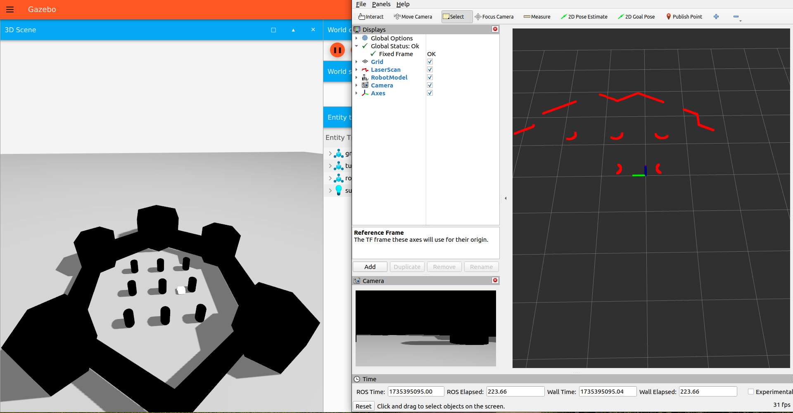

# ROS 2 With Gazebo Sim Tutorial

This tutorial focuses on integrating a **TurtleBot3 Waffle model** into the modern **Gazebo Sim (Ignition)** environment with ROS 2. It involves adding a **LiDAR sensor** and a **camera sensor** to the model, ensuring their data can be visualized in  **RViz 2** .

## Dependencies

This pkg need the following dependencies:

```
ros_gz_sim
ros_gz_bridge
sdformat
```

## Run the tutorial

1. Navigate to the WS directory where the pkg is located and then build the ws and source the build:

```bash
colcon build
source install/setup.bash
```

2. Then run the pkg by the following command :

```bash
ros2 launch robot_description robot.launch.py 
```

3. The output will be as shown below:



4. To move the robot use teleop_twist_keyboard and navigate the robot inside the world:

```bash
ros2 run teleop_twist_keyboard teleop_twist_keyboard
```


## References:

1. https://www.youtube.com/watch?v=KVe2u_2igkc

2. https://www.youtube.com/watch?v=fH4gkIFZ6W8

3. https://github.com/joshnewans/articubot_one/commit/e8a355fe8eb52c5a40a5240347bc204350a61266#diff-65ffb387cac03394885d419fc3bc09dc5dbd26776bb60a01fba0de06399011ac

4. https://gazebosim.org/docs/latest/migrating_gazebo_classic_ros2_packages/
